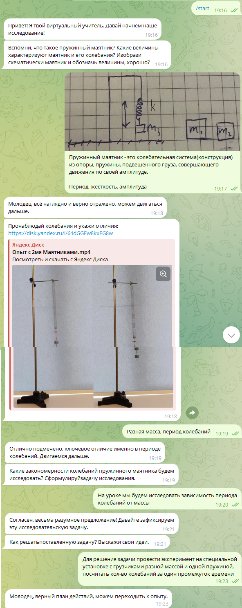
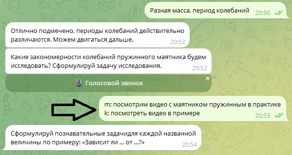
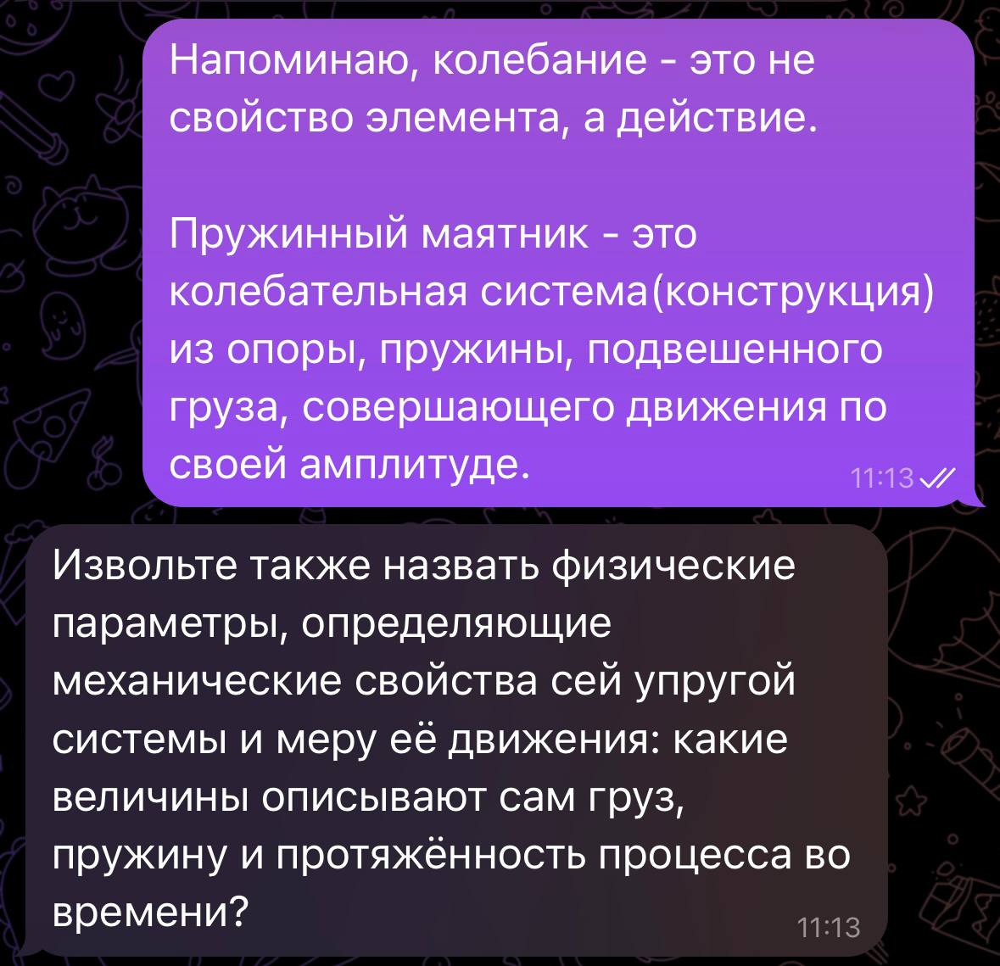
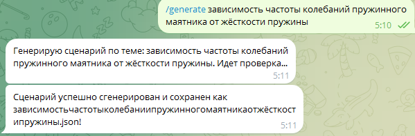

Агент представляет собой виртуального учителя физики, предназначенного для двух целевых аудиторий: учеников и методистов/учителей. Для учеников агент решает учебную задачу пошагового проведения исследовательского сценария (например, «зависимость периода колебаний пружинного маятника от массы груза»). Агент оценивает текстовые, голосовые и графические ответы ученика, опираясь на эталоны. Для учителей агент предоставляет режим автоматической генерации новых сценариев по заданным темам.

Архитектура агента состоит из следующих функциональных блоков:
1.1 Инициализация ввода.
1.2 Предобработка типичных ошибок.
1.3 Оценка ответа ученика.
1.4 Генерация новых учебных сценариев.

### Инструкция по запуску PowerShell, от им. Администратора

**Клон данных на ПК**
```powershell
git clone https://github.com/winsert1/Smart-physic-teacher
```

**Выдача разрешений компилятору**
```powershell
Set-ExecutionPolicy -ExecutionPolicy RemoteSigned -Scope Process
```

**Создание виртуального окружения**
```powershell
python.exe -m venv venv
```

**Активация виртуального окружения**
```powershell
venv\Scripts\Activate.ps1
```

**Установка библиотек**
```powershell
pip install -r requirements.txt
```

### Настройка .env: введите API_KEY из Google AI Studio и Telegram бота (на тест обращаться в тг: @evgenn1y)

**Запуск ПО**
```powershell
.\venv\Scripts\python.exe agent/main.py
```

### Таблица 1 Сводка аннотаций по ситуациям

| Ситуация / Поведение ученика | Реакция агента |
| :--- | :--- |
| Ученик проявляет стремление к учёбе, отвечает верно | Агент хвалит за верные ответы |
| Ученик ленится, тянет время, упрекает и др. | Агент меняет манеру общения с вежливого и непринуждённого в разговорно-бытовой стиль, в архаично-книжный, крайне в приказной |
| Типичная ошибка | Агент выдаёт эталонный вариант помощи из базы |
| Генерация нового сценария | Агент в соответствии с шаблоном поменяет величины в вопросах (без изменения ссылок и скриншотов) |
| Live-режим | Ученик запустит браузер и будет общаться онлайн по сценарию обучения. |

<br>


*Рисунок 1 - Cитуация 1, ученик отвечает верно, агент продолжает движение по сценарию*

<br>


*Рисунок 2 - Ситуация 2, типичная ошибка*

<br>


*Рисунок 3 - Ситуация 3, необычное поведение ученика*

<br>


*Рисунок 4 - Ситуация с работой по генерации нового сценария*
